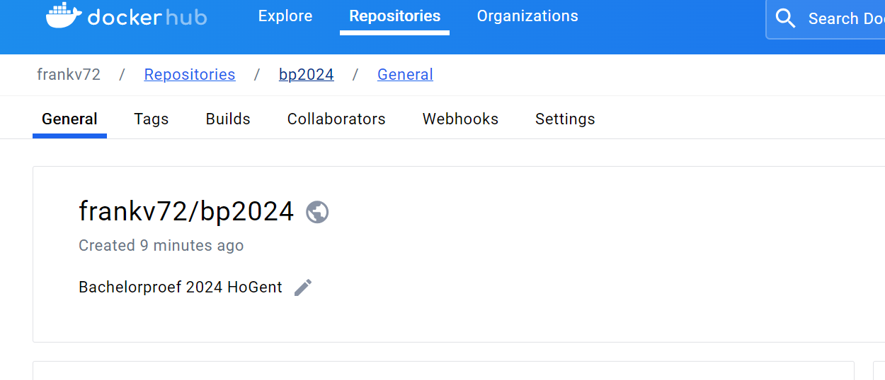
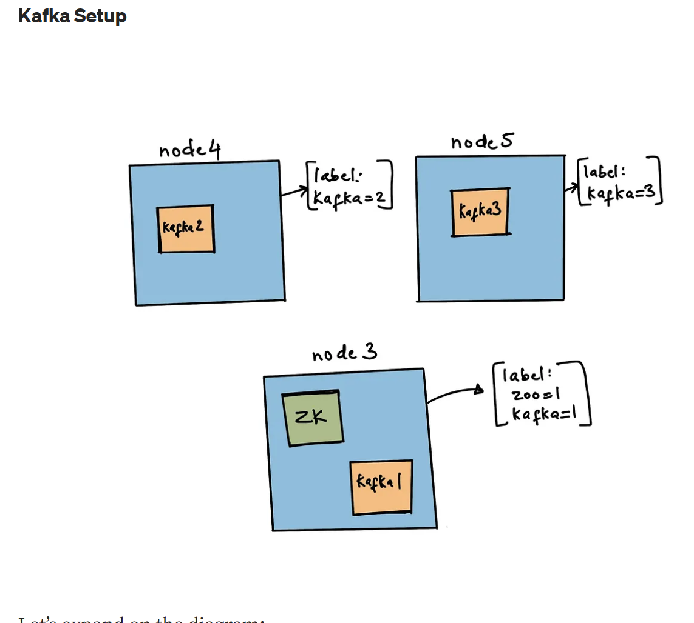

# Create Kafka KRaft Installation with Docker Swarm for BP2024


## Build Kafka Docker Image

### Install Docker on CentOS Node 1

```console
sudo yum install -y yum-utils
sudo yum-config-manager --add-repo https://download.docker.com/linux/centos/docker-ce.repo
sudo yum install docker-ce docker-ce-cli containerd.io docker-buildx-plugin docker-compose-plugin

```

```console
sudo groupadd docker
sudo usermod -aG docker bp2024
newgrp docker
sudo nano /etc/docker/deamon.json
```

```json
{
  "log-driver": "json-file",
  "log-opts": {
    "max-size": "10m",
    "max-file": "3"
  }
}
```

```console
sudo systemctl enable docker.service
sudo systemctl enable containerd.service
sudo systemctl start docker

Created symlink /etc/systemd/system/multi-user.target.wants/docker.service → /usr/lib/systemd/system/docker.service.
Created symlink /etc/systemd/system/multi-user.target.wants/containerd.service → /usr/lib/systemd/system/containerd.service.
```
### Disable firewall Node 1

sudo systemctl stop firewalld
sudo systemctl disable firewalld

### Install Docker on CentOS Node 2

```console
sudo yum install -y yum-utils
sudo yum-config-manager --add-repo https://download.docker.com/linux/centos/docker-ce.repo
sudo yum install docker-ce docker-ce-cli containerd.io docker-buildx-plugin docker-compose-plugin

```

```console
sudo groupadd docker
sudo usermod -aG docker bp2024
newgrp docker
sudo nano /etc/docker/deamon.json
```

```json
{
  "log-driver": "json-file",
  "log-opts": {
    "max-size": "10m",
    "max-file": "3"
  }
}
```

```console
sudo systemctl enable docker.service
sudo systemctl enable containerd.service
sudo systemctl start docker

Created symlink /etc/systemd/system/multi-user.target.wants/docker.service → /usr/lib/systemd/system/docker.service.
Created symlink /etc/systemd/system/multi-user.target.wants/containerd.service → /usr/lib/systemd/system/containerd.service.
```


### Create kafka docker image
download kafka
wget https://downloads.apache.org/kafka/3.7.0/kafka_2.13-3.7.0.tgz
Create docker file

```dockerfile
# Dockerfile
FROM ubuntu:16.04
# Install jdk 
RUN apt-get update && apt-get install openjdk-8-jre -y 
# Unzip kafka zip and rename at kafka
ENV kafka_version=2.13-3.7.0
ADD ./kafka_${kafka_version}.tgz ./
RUN mv kafka_${kafka_version} /opt/kafka
RUN /opt/kafka/bin/kafka-storage.sh format -t azgB17mFT8if8tYAPn4y6Q -c /opt/kafka/config/kraft/server.properties

```


```console
docker build -t kafkabp2024:1.1 .
[bp2024@control Kafka]$ docker build -t kafkabp2024:1.1 .
[+] Building 46.7s (9/9) FINISHED                                                                                                                                                               docker:default 
 => [internal] load build definition from dockerfile                                                                                                                                                      0.0s 
 => => transferring dockerfile: 339B                                                                                                                                                                      0.0s 
 => [internal] load metadata for docker.io/library/ubuntu:16.04                                                                                                                                           1.9s 
 => [internal] load .dockerignore                                                                                                                                                                         0.0s 
 => => transferring context: 2B                                                                                                                                                                           0.0s 
 => [1/4] FROM docker.io/library/ubuntu:16.04@sha256:1f1a2d56de1d604801a9671f301190704c25d604a416f59e03c04f5c6ffee0d6                                                                                     6.7s 
 => => resolve docker.io/library/ubuntu:16.04@sha256:1f1a2d56de1d604801a9671f301190704c25d604a416f59e03c04f5c6ffee0d6                                                                                     0.0s
 => => sha256:da8ef40b9ecabc2679fe2419957220c0272a965c5cf7e0269fa1aeeb8c56f2e1 528B / 528B                                                                                                                0.6s
 => => sha256:1f1a2d56de1d604801a9671f301190704c25d604a416f59e03c04f5c6ffee0d6 1.42kB / 1.42kB                                                                                                            0.0s
 => => sha256:a3785f78ab8547ae2710c89e627783cfa7ee7824d3468cae6835c9f4eae23ff7 1.15kB / 1.15kB                                                                                                            0.0s
 => => sha256:b6f50765242581c887ff1acc2511fa2d885c52d8fb3ac8c4bba131fd86567f2e 3.36kB / 3.36kB                                                                                                            0.0s
 => => sha256:58690f9b18fca6469a14da4e212c96849469f9b1be6661d2342a4bf01774aa50 46.50MB / 46.50MB                                                                                                          3.5s
 => => sha256:b51569e7c50720acf6860327847fe342a1afbe148d24c529fb81df105e3eed01 857B / 857B                                                                                                                0.5s
 => => sha256:fb15d46c38dcd1ea0b1990006c3366ecd10c79d374f341687eb2cb23a2c8672e 170B / 170B                                                                                                                1.0s
 => => extracting sha256:58690f9b18fca6469a14da4e212c96849469f9b1be6661d2342a4bf01774aa50                                                                                                                 3.0s
 => => extracting sha256:b51569e7c50720acf6860327847fe342a1afbe148d24c529fb81df105e3eed01                                                                                                                 0.0s
 => => extracting sha256:da8ef40b9ecabc2679fe2419957220c0272a965c5cf7e0269fa1aeeb8c56f2e1                                                                                                                 0.0s
 => => extracting sha256:fb15d46c38dcd1ea0b1990006c3366ecd10c79d374f341687eb2cb23a2c8672e                                                                                                                 0.0s
 => [internal] load build context                                                                                                                                                                         1.5s
 => => transferring context: 119.05MB                                                                                                                                                                     1.4s
 => [2/4] RUN apt-get update && apt-get install openjdk-8-jre -y                                                                                                                                         33.6s
 => [3/4] ADD ./kafka_2.13-3.7.0.tgz ./                                                                                                                                                                   1.4s
 => [4/4] RUN mv kafka_2.13-3.7.0 kafka                                                                                                                                                                   0.4s
 => exporting to image                                                                                                                                                                                    2.4s
 => => exporting layers                                                                                                                                                                                   2.4s
 => => writing image sha256:d95165fabb68fad2ccb62c4558733286c63d40acef397ac72465f7fac1cdd410                                                                                                              0.0s
 => => naming to docker.io/library/kafkabp2024:1.0                                                                                                                                                        0.0s
[bp2024@control Kafka]$ 
```

Image is build locally

### Upload kafka docker image to Docker Hub

```console
docker tag docker.io/library/kafkabp2024:1.2 frankv72/bp2024:1.2

```

create repo on docker hub



```console
docker login docker.io
docker push frankv72/bp2024:1.1

The push refers to repository [docker.io/frankv72/bp2024]

```

## Set up Docker Swarm
Create 3  VMs in VirtualBoxVM (node1, node2, node3)
Install docker in node1, node2 and node3.
(We plan to create docker swarm using node1, node2)

Step 1: Let’s make node1 as swarm manager

```console
ssh bp2024@172.16.0.3
[bp2024@node1 ~]$

[bp2024@node1 ~]$ docker swarm init
Error response from daemon: could not choose an IP address to advertise since this system has multiple addresses on different interfaces (10.0.2.15 on enp0s3 and 172.16.0.3 on enp0s8) - specify one with --advertise-addr
[bp2024@node1 ~]$ docker swarm init --advertise-addr 172.16.0.3
Swarm initialized: current node (b0vxtj6gwr42pxprruskc928d) is now a manager.
To add a worker to this swarm, run the following command:

    docker swarm join --token SWMTKN-1-1xp48hce8actwhm8xm8bcpnlytw1w08ylo2k3sfp1pho1wyqou-7wkuamavf2b7wh9p77ytujjzg 172.16.0.3:2377

To add a manager to this swarm, run 'docker swarm join-token manager' and follow the instructions.
```

Step 2: Let’s make node2 as swarm worker

ssh bp2024@172.16.0.4
[bp2024@node2 ~]$ 

node2 > docker swarm join --token SWMTKN-1-1xp48hce8actwhm8xm8bcpnlytw1w08ylo2k3sfp1pho1wyqou-7wkuamavf2b7wh9p77ytujjzg 172.16.0.3:2377
This node joined a swarm as a worker.


## Create Docker Swarm 2 nodes



No zookeeper

Broker service: kafka1 would run in node1
Broker service: kafka2 would run in node2

Node1 = Swarm Manager
Node2 = Swarm Worker
Node3 = client

node1 > sudo nano /etc/hosts
add
172.16.0.4      node2

[bp2024@node1 ~]$ ping node2
PING node2 (172.16.0.4) 56(84) bytes of data.
64 bytes from node2 (172.16.0.4): icmp_seq=1 ttl=64 time=0.709 ms
64 bytes from node2 (172.16.0.4): icmp_seq=2 ttl=64 time=0.708 ms

node2 > sudo nano /etc/hosts
add
172.16.0.3      node1

bp2024@node2 ~]$ ping node1
PING node1 (172.16.0.3) 56(84) bytes of data.
64 bytes from node1 (172.16.0.3): icmp_seq=1 ttl=64 time=0.805 ms
64 bytes from node1 (172.16.0.3): icmp_seq=2 ttl=64 time=0.826 ms

### Setup labels in nodes

```console
[bp2024@node1 ~]$ docker node update --label-add kafka=1 node1
node1
[bp2024@node1 ~]$ docker node update --label-add kafka=2 node2
node2
```

### Setup Kafka Cluster using docker swarm commands
First, we will attempt to setup kafka cluster using docker swarm commands, so that we can understand how do we compose them.

Step 1: Create a overlay network: kafka-net

```console
[bp2024@node1 ~]$ docker network create --driver overlay kafka-net
uujtx6dbama4lm925o92jhg2z
```

Step 2: Create broker : kafka1

```console
docker service create \
--name kafka1 \
--mount type=volume,source=k1-logs,destination=/tmp/kafka-logs \
--publish 9092:9092 \
--network kafka-net \
--mode global \
--constraint node.labels.kafka==1 \
frankv72/bp2024:1.0 \
/kafka/bin/kafka-server-start.sh /kafka/config/server.properties \
--env KAFKA_NODE_ID: 1 \
--env KAFKA_CONTROLLER_LISTENER_NAMES: 'CONTROLLER' \
--env KAFKA_LISTENER_SECURITY_PROTOCOL_MAP: 'CONTROLLER:PLAINTEXT,INTERNAL:PLAINTEXT,EXTERNAL:PLAINTEXT' \
--env KAFKA_LISTENERS: 'INTERNAL://kafka1:29092,CONTROLLER://kafka1:29093,EXTERNAL://0.0.0.0:9092' \
--env KAFKA_ADVERTISED_LISTENERS: 'INTERNAL://kafka1:29092,EXTERNAL://localhost:9092' \
--env KAFKA_INTER_BROKER_LISTENER_NAME: 'INTERNAL' \
--env KAFKA_CONTROLLER_QUORUM_VOTERS: '1@kafka1:29093,2@kafka2:29093,3@kafka3:29093' \
--env KAFKA_PROCESS_ROLES: 'broker,controller' \
--env KAFKA_GROUP_INITIAL_REBALANCE_DELAY_MS: 0 \
--env KAFKA_OFFSETS_TOPIC_REPLICATION_FACTOR: 3 \
--env KAFKA_TRANSACTION_STATE_LOG_REPLICATION_FACTOR: 3 \
--env CLUSTER_ID: 'ciWo7IWazngRchmPES6q5A==' \
--env KAFKA_LOG_DIRS: '/tmp/kraft-combined-logs' 
```

This works
```console
docker service create \
    --name kafka1 \
    --mount type=volume,source=k1-logs,destination=/tmp/kafka-logs \
    --publish 9093:9093 \
    --network kafka-net \
    --mode global \
    --constraint node.labels.kafka==1 \
frankv72/bp2024:1.0 \
/kafka/bin/kafka-server-start.sh /kafka/config/server.properties \
 --override listeners=INT://:9092,EXT://0.0.0.0:9093 \
 --override listener.security.protocol.map=INT:PLAINTEXT,EXT:PLAINTEXT \
 --override inter.broker.listener.name=INT \
 --override advertised.listeners=INT://:9092,EXT://node3:9093 \
 --override broker.id=1
```

Now go for second broker on node2


docker service create \
  --name kafka2 \
  --mount type=volume,source=k2-logs,destination=/tmp/kafka-logs \
  --publish 9094:9094 \
  --network kafka-net \
  --mode global \
  --constraint node.labels.kafka==2 \
frankv72/bp2024:1.0 \
/kafka/bin/kafka-server-start.sh /kafka/config/server.properties \
 --override listeners=INT://:9092,EXT://0.0.0.0:9094 \
 --override listener.security.protocol.map=INT:PLAINTEXT,EXT:PLAINTEXT \
 --override inter.broker.listener.name=INT \
 --override advertised.listeners=INT://:9092,EXT://node4:9094 \
 --override broker.id=2


 #### test 

wget https://downloads.apache.org/kafka/3.7.0/kafka_2.13-3.7.0.tgz
sudo dnf install java-11-openjdk
tar xfz kafka_2.13-3.7.0.tgz 
mv kafka_2.13-3.7.0 kafka

bin/kafka-topics.sh  \
--bootstrap-server 172.16.0.3:9093 \
--create \
--replication-factor 1 \
--partitions 1 \
--topic test


```console
docker service create \
    --name kafka1 \
    --mount type=volume,source=k1-logs,destination=/tmp/kafka-logs \
    --publish 9093:9093 \
    --network kafka-net \
    --mode global \
    --constraint node.labels.kafka==1 \
frankv72/bp2024:1.2 \
/opt/kafka/bin/kafka-server-start.sh /opt/kafka/config/kraft/server.properties \
--override node.id=1 \
--override broker.id=1 \
--override num.network.threads=3 \
--override num.io.threads=8 \
--override process.roles=broker,controller  \
--override listeners=BROKER://0.0.0.0:9092,CONTROLLER://0.0.0.0:9093  \
--override advertised.listeners=BROKER://172.16.0.3:9092  \
--override listener.security.protocol.map=BROKER:SASL_PLAINTEXT,CONTROLLER:SASL_PLAINTEXT  \
--override controller.listener.names=CONTROLLER  \
--override controller.quorum.voters=1@172.16.0.3:9093  \
--override inter.broker.listener.name=BROKER  \
--override sasl.enabled.mechanisms=PLAIN  \
--override sasl.mechanism.controller.protocol=PLAIN  \
--override sasl.mechanism.inter.broker.protocol=PLAIN \
--override authorizer.class.name=org.apache.kafka.metadata.authorizer.StandardAuthorizer  \
--override allow.everyone.if.no.acl.found=false  \
--override super.users=User:admin  \
--override delete.topic.enable=true  \
--override socket.send.buffer.bytes=1048576  \
--override socket.receive.buffer.bytes=1048576  \
--override socket.request.max.bytes=104857600 \
--override num.partitions=3  \
--override default.replication.factor=2  \
--override min.insync.replicas=2  \
--override log.retention.hours=168  \
--override log.segment.bytes=1073741824  \
--override log.retention.check.interval.ms=300000  \
--override auto.create.topics.enable=true  \
--override unclean.leader.election.enable=false  


azgB17mFT8if8tYAPn4y6Q
bash kafka/bin/kafka-storage.sh format -t azgB17mFT8if8tYAPn4y6Q -c kafka/config/kraft/server.properties

```
check 

```console
[bp2024@node1 Kafka]$ docker service logs kafka1
kafka1.0.hprqsegg24cg@node1    | [2024-03-28 09:22:24,101] INFO Registered kafka:type=kafka.Log4jController MBean (kafka.utils.Log4jControllerRegistration$)
kafka1.0.hprqsegg24cg@node1    | [2024-03-28 09:22:24,441] INFO Setting -D jdk.tls.rejectClientInitiatedRenegotiation=true to disable client-initiated TLS renegotiation (org.apache.zookeeper.common.X509Util)
kafka1.0.hprqsegg24cg@node1    | [2024-03-28 09:22:24,574] INFO Registered signal handlers for TERM, INT, HUP (org.apache.kafka.common.utils.LoggingSignalHandler)
kafka1.0.hprqsegg24cg@node1    | [2024-03-28 09:22:24,580] INFO [ControllerServer id=1] Starting controller (kafka.server.ControllerServer)
kafka1.0.hprqsegg24cg@node1    | [2024-03-28 09:22:24,605] INFO [StandardAuthorizer 1] set super.users=User:admin, default result=DENIED (org.apache.kafka.metadata.authorizer.StandardAuthorizerData)
kafka1.0.hprqsegg24cg@node1    | [2024-03-28 09:22:25,070] INFO Updated connection-accept-rate max connection creation rate to 2147483647 (kafka.network.ConnectionQuotas)
kafka1.0.hprqsegg24cg@node1    | [2024-03-28 09:22:25,111] INFO Successfully logged in. (org.apache.kafka.common.security.authenticator.AbstractLogin)
kafka1.0.hprqsegg24cg@node1    | [2024-03-28 09:22:25,123] INFO [SocketServer listenerType=CONTROLLER, nodeId=1] Created data-plane acceptor and processors for endpoint : ListenerName(CONTROLLER) (kafka.network.SocketServer)
kafka1.0.hprqsegg24cg@node1    | [2024-03-28 09:22:25,130] INFO authorizerStart completed for endpoint CONTROLLER. Endpoint is now READY. (org.apache.kafka.server.network.EndpointReadyFutures)
kafka1.0.hprqsegg24cg@node1    | [2024-03-28 09:22:25,131] INFO [SharedServer id=1] Starting SharedServer (kafka.server.SharedServer)
kafka1.0.hprqsegg24cg@node1    | [2024-03-28 09:22:25,198] INFO [LogLoader partition=__cluster_metadata-0, dir=/tmp/kraft-combined-logs] Loading producer state till offset 0 with message format version 2 (kafka.log.UnifiedLog$)
kafka1.0.hprqsegg24cg@node1    | [2024-03-28 09:22:25,200] INFO [LogLoader partition=__cluster_metadata-0, dir=/tmp/kraft-combined-logs] Reloading from producer snapshot and rebuilding producer state from offset 0 (kafka.log.UnifiedLog$)
kafka1.0.hprqsegg24cg@node1    | [2024-03-28 09:22:25,200] INFO [LogLoader partition=__cluster_metadata-0, dir=/tmp/kraft-combined-logs] Producer state recovery took 0ms for snapshot load and 0ms for segment recovery from offset 0 (kafka.log.UnifiedLog$)
kafka1.0.hprqsegg24cg@node1    | [2024-03-28 09:22:25,240] INFO Initialized snapshots with IDs SortedSet() from /tmp/kraft-combined-logs/__cluster_metadata-0 (kafka.raft.KafkaMetadataLog$)
kafka1.0.hprqsegg24cg@node1    | [2024-03-28 09:22:25,256] INFO [raft-expiration-reaper]: Starting (kafka.raft.TimingWheelExpirationService$ExpiredOperationReaper)
kafka1.0.hprqsegg24cg@node1    | [2024-03-28 09:22:25,402] INFO [RaftManager id=1] Completed transition to Unattached(epoch=0, voters=[1], electionTimeoutMs=1071) from null (org.apache.kafka.raft.QuorumState)
kafka1.0.hprqsegg24cg@node1    | [2024-03-28 09:22:25,410] INFO [RaftManager id=1] Completed transition to CandidateState(localId=1, epoch=1, retries=1, voteStates={1=GRANTED}, highWatermark=Optional.empty, electionTimeoutMs=1292) from Unattached(epoch=0, voters=[1], electionTimeoutMs=1071) (org.apache.kafka.raft.QuorumState)
kafka1.0.hprqsegg24cg@node1    | [2024-03-28 09:22:25,425] INFO [RaftManager id=1] Completed transition to Leader(localId=1, epoch=1, epochStartOffset=0, highWatermark=Optional.empty, voterStates={1=ReplicaState(nodeId=1, endOffset=Optional.empty, lastFetchTimestamp=-1, lastCaughtUpTimestamp=-1, hasAcknowledgedLeader=true)}) from CandidateState(localId=1, epoch=1, retries=1, voteStates={1=GRANTED}, highWatermark=Optional.empty, electionTimeoutMs=1292) (org.apache.kafka.raft.QuorumState)
kafka1.0.hprqsegg24cg@node1    | [2024-03-28 09:22:25,454] INFO [kafka-1-raft-outbound-request-thread]: Starting (org.apache.kafka.raft.KafkaNetworkChannel$SendThread)
kafka1.0.hprqsegg24cg@node1    | [2024-03-28 09:22:25,458] INFO [kafka-1-raft-io-thread]: Starting (kafka.raft.KafkaRaftManager$RaftIoThread)
kafka1.0.hprqsegg24cg@node1    | [2024-03-28 09:22:25,492] INFO [MetadataLoader id=1] initializeNewPublishers: the loader is still catching up because we still don't know the high water mark yet. (org.apache.kafka.image.loader.MetadataLoader)
kafka1.0.hprqsegg24cg@node1    | [2024-03-28 09:22:25,494] INFO [ControllerServer id=1] Waiting for controller quorum voters future (kafka.server.ControllerServer)
kafka1.0.hprqsegg24cg@node1    | [2024-03-28 09:22:25,494] INFO [ControllerServer id=1] Finished waiting for controller quorum voters future (kafka.server.ControllerServer)        
kafka1.0.hprqsegg24cg@node1    | [2024-03-28 09:22:25,517] INFO [RaftManager id=1] High watermark set to LogOffsetMetadata(offset=1, metadata=Optional[(segmentBaseOffset=0,relativePositionInSegment=91)]) for the first time for epoch 1 based on indexOfHw 0 and voters [ReplicaState(nodeId=1, endOffset=Optional[LogOffsetMetadata(offset=1, metadata=Optional[(segmentBaseOffset=0,relativePositionInSegment=91)])], lastFetchTimestamp=-1, lastCaughtUpTimestamp=-1, hasAcknowledgedLeader=true)] (org.apache.kafka.raft.LeaderState)
kafka1.0.hprqsegg24cg@node1    | [2024-03-28 09:22:25,529] INFO [RaftManager id=1] Registered the listener org.apache.kafka.image.loader.MetadataLoader@489869747 (org.apache.kafka.raft.KafkaRaftClient)
kafka1.0.hprqsegg24cg@node1    | [2024-03-28 09:22:25,538] INFO [MetadataLoader id=1] maybePublishMetadata(LOG_DELTA): The loader is still catching up because we have not loaded a controller record as of offset 0 and high water mark is 1 (org.apache.kafka.image.loader.MetadataLoader)
kafka1.0.hprqsegg24cg@node1    | [2024-03-28 09:22:25,560] INFO [RaftManager id=1] Registered the listener org.apache.kafka.controller.QuorumController$QuorumMetaLogListener@1399942915 (org.apache.kafka.raft.KafkaRaftClient)
kafka1.0.hprqsegg24cg@node1    | [2024-03-28 09:22:25,568] INFO [controller-1-ThrottledChannelReaper-Fetch]: Starting (kafka.server.ClientQuotaManager$ThrottledChannelReaper)      
kafka1.0.hprqsegg24cg@node1    | [2024-03-28 09:22:25,569] INFO [controller-1-ThrottledChannelReaper-Produce]: Starting (kafka.server.ClientQuotaManager$ThrottledChannelReaper)    
kafka1.0.hprqsegg24cg@node1    | [2024-03-28 09:22:25,571] INFO [controller-1-ThrottledChannelReaper-Request]: Starting (kafka.server.ClientQuotaManager$ThrottledChannelReaper)    
kafka1.0.hprqsegg24cg@node1    | [2024-03-28 09:22:25,572] INFO [controller-1-ThrottledChannelReaper-ControllerMutation]: Starting (kafka.server.ClientQuotaManager$ThrottledChannelReaper)
kafka1.0.hprqsegg24cg@node1    | [2024-03-28 09:22:25,609] INFO [MetadataLoader id=1] initializeNewPublishers: The loader finished catching up to the current high water mark of 1 (org.apache.kafka.image.loader.MetadataLoader)
kafka1.0.hprqsegg24cg@node1    | [2024-03-28 09:22:25,618] INFO [MetadataLoader id=1] InitializeNewPublishers: initializing SnapshotGenerator with a snapshot at offset 0 (org.apache.kafka.image.loader.MetadataLoader)
kafka1.0.hprqsegg24cg@node1    | [2024-03-28 09:22:25,627] INFO [ExpirationReaper-1-AlterAcls]: Starting (kafka.server.DelayedOperationPurgatory$ExpiredOperationReaper)
kafka1.0.hprqsegg24cg@node1    | [2024-03-28 09:22:25,673] INFO [MetadataLoader id=1] InitializeNewPublishers: initializing KRaftMetadataCachePublisher with a snapshot at offset 4 (org.apache.kafka.image.loader.MetadataLoader)
kafka1.0.hprqsegg24cg@node1    | [2024-03-28 09:22:25,673] INFO [MetadataLoader id=1] InitializeNewPublishers: initializing FeaturesPublisher with a snapshot at offset 4 (org.apache.kafka.image.loader.MetadataLoader)
kafka1.0.hprqsegg24cg@node1    | [2024-03-28 09:22:25,674] INFO [ControllerServer id=1] Loaded new metadata Features(version=3.7-IV4, finalizedFeatures={metadata.version=19}, finalizedFeaturesEpoch=4). (org.apache.kafka.metadata.publisher.FeaturesPublisher)
kafka1.0.hprqsegg24cg@node1    | [2024-03-28 09:22:25,674] INFO [MetadataLoader id=1] InitializeNewPublishers: initializing ControllerRegistrationsPublisher with a snapshot at offset 4 (org.apache.kafka.image.loader.MetadataLoader)
kafka1.0.hprqsegg24cg@node1    | [2024-03-28 09:22:25,674] INFO [MetadataLoader id=1] InitializeNewPublishers: initializing ControllerRegistrationManager with a snapshot at offset 4 (org.apache.kafka.image.loader.MetadataLoader)
kafka1.0.hprqsegg24cg@node1    | [2024-03-28 09:22:25,675] INFO [MetadataLoader id=1] InitializeNewPublishers: initializing DynamicConfigPublisher controller id=1 with a snapshot at offset 4 (org.apache.kafka.image.loader.MetadataLoader)
kafka1.0.hprqsegg24cg@node1    | [2024-03-28 09:22:25,676] INFO [MetadataLoader id=1] InitializeNewPublishers: initializing DynamicClientQuotaPublisher controller id=1 with a snapshot at offset 4 (org.apache.kafka.image.loader.MetadataLoader)
kafka1.0.hprqsegg24cg@node1    | [2024-03-28 09:22:25,678] INFO [MetadataLoader id=1] InitializeNewPublishers: initializing ScramPublisher controller id=1 with a snapshot at offset 4 (org.apache.kafka.image.loader.MetadataLoader)
kafka1.0.hprqsegg24cg@node1    | [2024-03-28 09:22:25,679] INFO [MetadataLoader id=1] InitializeNewPublishers: initializing DelegationTokenPublisher controller id=1 with a snapshot at offset 4 (org.apache.kafka.image.loader.MetadataLoader)
kafka1.0.hprqsegg24cg@node1    | [2024-03-28 09:22:25,681] INFO [MetadataLoader id=1] InitializeNewPublishers: initializing ControllerMetadataMetricsPublisher with a snapshot at offset 4 (org.apache.kafka.image.loader.MetadataLoader)
kafka1.0.hprqsegg24cg@node1    | [2024-03-28 09:22:25,681] INFO [ControllerServer id=1] Waiting for the controller metadata publishers to be installed (kafka.server.ControllerServer)
kafka1.0.hprqsegg24cg@node1    | [2024-03-28 09:22:25,681] INFO [ControllerServer id=1] Finished waiting for the controller metadata publishers to be installed (kafka.server.ControllerServer)
kafka1.0.hprqsegg24cg@node1    | [2024-03-28 09:22:25,682] INFO [SocketServer listenerType=CONTROLLER, nodeId=1] Enabling request processing. (kafka.network.SocketServer)
kafka1.0.hprqsegg24cg@node1    | [2024-03-28 09:22:25,686] INFO Awaiting socket connections on 0.0.0.0:9093. (kafka.network.DataPlaneAcceptor)
kafka1.0.hprqsegg24cg@node1    | [2024-03-28 09:22:25,687] INFO [MetadataLoader id=1] InitializeNewPublishers: initializing AclPublisher controller id=1 with a snapshot at offset 4 (org.apache.kafka.image.loader.MetadataLoader)
kafka1.0.hprqsegg24cg@node1    | [2024-03-28 09:22:25,688] INFO [AclPublisher controller id=1] Loading authorizer snapshot at offset 4 (kafka.server.metadata.AclPublisher)
kafka1.0.hprqsegg24cg@node1    | [2024-03-28 09:22:25,688] INFO [StandardAuthorizer 1] Initialized with 0 acl(s). (org.apache.kafka.metadata.authorizer.StandardAuthorizerData)     
kafka1.0.hprqsegg24cg@node1    | [2024-03-28 09:22:25,688] INFO [StandardAuthorizer 1] Completed initial ACL load process. (org.apache.kafka.metadata.authorizer.StandardAuthorizerData)
kafka1.0.hprqsegg24cg@node1    | [2024-03-28 09:22:25,702] INFO [ControllerServer id=1] Waiting for all of the authorizer futures to be completed (kafka.server.ControllerServer)   
kafka1.0.hprqsegg24cg@node1    | [2024-03-28 09:22:25,702] INFO [ControllerServer id=1] Finished waiting for all of the authorizer futures to be completed (kafka.server.ControllerServer)
kafka1.0.hprqsegg24cg@node1    | [2024-03-28 09:22:25,703] INFO [ControllerRegistrationManager id=1 incarnation=s88ZhL0BTva6Vpkj67v3mQ] initialized channel manager. (kafka.server.ControllerRegistrationManager)
kafka1.0.hprqsegg24cg@node1    | [2024-03-28 09:22:25,703] INFO [ControllerServer id=1] Waiting for all of the SocketServer Acceptors to be started (kafka.server.ControllerServer) 
kafka1.0.hprqsegg24cg@node1    | [2024-03-28 09:22:25,703] INFO [ControllerServer id=1] Finished waiting for all of the SocketServer Acceptors to be started (kafka.server.ControllerServer)
kafka1.0.hprqsegg24cg@node1    | [2024-03-28 09:22:25,704] INFO [BrokerServer id=1] Transition from SHUTDOWN to STARTING (kafka.server.BrokerServer)
kafka1.0.hprqsegg24cg@node1    | [2024-03-28 09:22:25,705] INFO [ControllerRegistrationManager id=1 incarnation=s88ZhL0BTva6Vpkj67v3mQ] sendControllerRegistration: attempting to send ControllerRegistrationRequestData(controllerId=1, incarnationId=s88ZhL0BTva6Vpkj67v3mQ, zkMigrationReady=false, listeners=[Listener(name='CONTROLLER', host='0.0.0.0', port=9093, securityProtocol=2)], features=[Feature(name='metadata.version', minSupportedVersion=1, maxSupportedVersion=19)]) (kafka.server.ControllerRegistrationManager)
kafka1.0.hprqsegg24cg@node1    | [2024-03-28 09:22:25,705] INFO [BrokerServer id=1] Starting broker (kafka.server.BrokerServer)
kafka1.0.hprqsegg24cg@node1    | [2024-03-28 09:22:25,712] INFO [controller-1-to-controller-registration-channel-manager]: Starting (kafka.server.NodeToControllerRequestThread)    
kafka1.0.hprqsegg24cg@node1    | [2024-03-28 09:22:25,714] INFO [controller-1-to-controller-registration-channel-manager]: Recorded new controller, from now on will use node 172.16.0.3:9093 (id: 1 rack: null) (kafka.server.NodeToControllerRequestThread)
kafka1.0.hprqsegg24cg@node1    | [2024-03-28 09:22:25,732] INFO [broker-1-ThrottledChannelReaper-Fetch]: Starting (kafka.server.ClientQuotaManager$ThrottledChannelReaper)
kafka1.0.hprqsegg24cg@node1    | [2024-03-28 09:22:25,732] INFO [broker-1-ThrottledChannelReaper-Produce]: Starting (kafka.server.ClientQuotaManager$ThrottledChannelReaper)        
kafka1.0.hprqsegg24cg@node1    | [2024-03-28 09:22:25,733] INFO [broker-1-ThrottledChannelReaper-Request]: Starting (kafka.server.ClientQuotaManager$ThrottledChannelReaper)        
kafka1.0.hprqsegg24cg@node1    | [2024-03-28 09:22:25,741] INFO [broker-1-ThrottledChannelReaper-ControllerMutation]: Starting (kafka.server.ClientQuotaManager$ThrottledChannelReaper)
kafka1.0.hprqsegg24cg@node1    | [2024-03-28 09:22:25,792] INFO [BrokerServer id=1] Waiting for controller quorum voters future (kafka.server.BrokerServer)
kafka1.0.hprqsegg24cg@node1    | [2024-03-28 09:22:25,793] INFO [BrokerServer id=1] Finished waiting for controller quorum voters future (kafka.server.BrokerServer)
kafka1.0.hprqsegg24cg@node1    | [2024-03-28 09:22:25,803] INFO [broker-1-to-controller-forwarding-channel-manager]: Starting (kafka.server.NodeToControllerRequestThread)
kafka1.0.hprqsegg24cg@node1    | [2024-03-28 09:22:25,803] INFO [broker-1-to-controller-forwarding-channel-manager]: Recorded new controller, from now on will use node 172.16.0.3:9093 (id: 1 rack: null) (kafka.server.NodeToControllerRequestThread)
kafka1.0.hprqsegg24cg@node1    | [2024-03-28 09:22:25,887] INFO Updated connection-accept-rate max connection creation rate to 2147483647 (kafka.network.ConnectionQuotas)
kafka1.0.hprqsegg24cg@node1    | [2024-03-28 09:22:25,893] INFO [ControllerRegistrationManager id=1 incarnation=s88ZhL0BTva6Vpkj67v3mQ] RegistrationResponseHandler: controller acknowledged ControllerRegistrationRequest. (kafka.server.ControllerRegistrationManager)
kafka1.0.hprqsegg24cg@node1    | [2024-03-28 09:22:25,890] INFO [ControllerRegistrationManager id=1 incarnation=s88ZhL0BTva6Vpkj67v3mQ] Our registration has been persisted to the metadata log. (kafka.server.ControllerRegistrationManager)
kafka1.0.hprqsegg24cg@node1    | [2024-03-28 09:22:25,898] INFO [SocketServer listenerType=BROKER, nodeId=1] Created data-plane acceptor and processors for endpoint : ListenerName(BROKER) (kafka.network.SocketServer)
kafka1.0.hprqsegg24cg@node1    | [2024-03-28 09:22:25,917] INFO [broker-1-to-controller-alter-partition-channel-manager]: Starting (kafka.server.NodeToControllerRequestThread)     
kafka1.0.hprqsegg24cg@node1    | [2024-03-28 09:22:25,917] INFO [broker-1-to-controller-alter-partition-channel-manager]: Recorded new controller, from now on will use node 172.16.0.3:9093 (id: 1 rack: null) (kafka.server.NodeToControllerRequestThread)
kafka1.0.hprqsegg24cg@node1    | [2024-03-28 09:22:25,938] INFO [broker-1-to-controller-directory-assignments-channel-manager]: Starting (kafka.server.NodeToControllerRequestThread)
kafka1.0.hprqsegg24cg@node1    | [2024-03-28 09:22:25,939] INFO [broker-1-to-controller-directory-assignments-channel-manager]: Recorded new controller, from now on will use node 172.16.0.3:9093 (id: 1 rack: null) (kafka.server.NodeToControllerRequestThread)
kafka1.0.hprqsegg24cg@node1    | [2024-03-28 09:22:25,950] INFO [ExpirationReaper-1-Produce]: Starting (kafka.server.DelayedOperationPurgatory$ExpiredOperationReaper)
kafka1.0.hprqsegg24cg@node1    | [2024-03-28 09:22:25,952] INFO [ExpirationReaper-1-Fetch]: Starting (kafka.server.DelayedOperationPurgatory$ExpiredOperationReaper)
kafka1.0.hprqsegg24cg@node1    | [2024-03-28 09:22:25,953] INFO [ExpirationReaper-1-DeleteRecords]: Starting (kafka.server.DelayedOperationPurgatory$ExpiredOperationReaper)        
kafka1.0.hprqsegg24cg@node1    | [2024-03-28 09:22:25,960] INFO [ExpirationReaper-1-RemoteFetch]: Starting (kafka.server.DelayedOperationPurgatory$ExpiredOperationReaper)
kafka1.0.hprqsegg24cg@node1    | [2024-03-28 09:22:25,960] INFO [ExpirationReaper-1-ElectLeader]: Starting (kafka.server.DelayedOperationPurgatory$ExpiredOperationReaper)
kafka1.0.hprqsegg24cg@node1    | [2024-03-28 09:22:25,986] INFO [ExpirationReaper-1-Heartbeat]: Starting (kafka.server.DelayedOperationPurgatory$ExpiredOperationReaper)
kafka1.0.hprqsegg24cg@node1    | [2024-03-28 09:22:25,987] INFO [ExpirationReaper-1-Rebalance]: Starting (kafka.server.DelayedOperationPurgatory$ExpiredOperationReaper)
kafka1.0.hprqsegg24cg@node1    | [2024-03-28 09:22:26,037] INFO Unable to read the broker epoch in /tmp/kraft-combined-logs. (kafka.log.LogManager)
kafka1.0.hprqsegg24cg@node1    | [2024-03-28 09:22:26,041] INFO [StandardAuthorizer 1] set super.users=User:admin, default result=DENIED (org.apache.kafka.metadata.authorizer.StandardAuthorizerData)
kafka1.0.hprqsegg24cg@node1    | [2024-03-28 09:22:26,049] INFO [BrokerLifecycleManager id=1] Incarnation 7GRYGVk9TBiij9fL98XgrQ of broker 1 in cluster azgB17mFT8if8tYAPn4y6Q is now STARTING. (kafka.server.BrokerLifecycleManager)
kafka1.0.hprqsegg24cg@node1    | [2024-03-28 09:22:26,050] INFO [broker-1-to-controller-heartbeat-channel-manager]: Starting (kafka.server.NodeToControllerRequestThread)
kafka1.0.hprqsegg24cg@node1    | [2024-03-28 09:22:26,050] INFO [broker-1-to-controller-heartbeat-channel-manager]: Recorded new controller, from now on will use node 172.16.0.3:9093 (id: 1 rack: null) (kafka.server.NodeToControllerRequestThread)
kafka1.0.hprqsegg24cg@node1    | [2024-03-28 09:22:26,078] INFO [ExpirationReaper-1-AlterAcls]: Starting (kafka.server.DelayedOperationPurgatory$ExpiredOperationReaper)
kafka1.0.hprqsegg24cg@node1    | [2024-03-28 09:22:26,117] INFO [MetadataLoader id=1] InitializeNewPublishers: initializing BrokerMetadataPublisher with a snapshot at offset 6 (org.apache.kafka.image.loader.MetadataLoader)
kafka1.0.hprqsegg24cg@node1    | [2024-03-28 09:22:26,119] INFO [BrokerMetadataPublisher id=1] Publishing initial metadata at offset OffsetAndEpoch(offset=6, epoch=1) with metadata.version 3.7-IV4. (kafka.server.metadata.BrokerMetadataPublisher)
kafka1.0.hprqsegg24cg@node1    | [2024-03-28 09:22:26,120] INFO Loading logs from log dirs ArraySeq(/tmp/kraft-combined-logs) (kafka.log.LogManager)
kafka1.0.hprqsegg24cg@node1    | [2024-03-28 09:22:26,123] INFO [BrokerServer id=1] Waiting for the broker metadata publishers to be installed (kafka.server.BrokerServer)
kafka1.0.hprqsegg24cg@node1    | [2024-03-28 09:22:26,124] INFO No logs found to be loaded in /tmp/kraft-combined-logs (kafka.log.LogManager)
kafka1.0.hprqsegg24cg@node1    | [2024-03-28 09:22:26,125] INFO [BrokerServer id=1] Finished waiting for the broker metadata publishers to be installed (kafka.server.BrokerServer) 
kafka1.0.hprqsegg24cg@node1    | [2024-03-28 09:22:26,126] INFO [BrokerServer id=1] Waiting for the controller to acknowledge that we are caught up (kafka.server.BrokerServer)     
kafka1.0.hprqsegg24cg@node1    | [2024-03-28 09:22:26,133] INFO Loaded 0 logs in 12ms (kafka.log.LogManager)
kafka1.0.hprqsegg24cg@node1    | [2024-03-28 09:22:26,134] INFO Starting log cleanup with a period of 300000 ms. (kafka.log.LogManager)
kafka1.0.hprqsegg24cg@node1    | [2024-03-28 09:22:26,135] INFO Starting log flusher with a default period of 9223372036854775807 ms. (kafka.log.LogManager)
kafka1.0.hprqsegg24cg@node1    | [2024-03-28 09:22:26,213] INFO [LogDirFailureHandler]: Starting (kafka.server.ReplicaManager$LogDirFailureHandler)
kafka1.0.hprqsegg24cg@node1    | [2024-03-28 09:22:26,215] INFO [GroupCoordinator 1]: Starting up. (kafka.coordinator.group.GroupCoordinator)
kafka1.0.hprqsegg24cg@node1    | [2024-03-28 09:22:26,219] INFO [AddPartitionsToTxnSenderThread-1]: Starting (kafka.server.AddPartitionsToTxnManager)
kafka1.0.hprqsegg24cg@node1    | [2024-03-28 09:22:26,224] INFO [kafka-log-cleaner-thread-0]: Starting (kafka.log.LogCleaner$CleanerThread)
kafka1.0.hprqsegg24cg@node1    | [2024-03-28 09:22:26,235] INFO [BrokerLifecycleManager id=1] Successfully registered broker 1 with broker epoch 7 (kafka.server.BrokerLifecycleManager)
kafka1.0.hprqsegg24cg@node1    | [2024-03-28 09:22:26,242] INFO [GroupCoordinator 1]: Startup complete. (kafka.coordinator.group.GroupCoordinator)
kafka1.0.hprqsegg24cg@node1    | [2024-03-28 09:22:26,244] INFO [TransactionCoordinator id=1] Starting up. (kafka.coordinator.transaction.TransactionCoordinator)
kafka1.0.hprqsegg24cg@node1    | [2024-03-28 09:22:26,258] INFO [TransactionCoordinator id=1] Startup complete. (kafka.coordinator.transaction.TransactionCoordinator)
kafka1.0.hprqsegg24cg@node1    | [2024-03-28 09:22:26,259] INFO [BrokerMetadataPublisher id=1] Updating metadata.version to 19 at offset OffsetAndEpoch(offset=6, epoch=1). (kafka.server.metadata.BrokerMetadataPublisher)
kafka1.0.hprqsegg24cg@node1    | [2024-03-28 09:22:26,261] INFO [BrokerMetadataPublisher id=1] Resending BrokerRegistration with existing incarnation-id to inform the controller about log directories in the broker following metadata update: previousMetadataVersion: 3.0-IV1 newMetadataVersion: 3.7-IV4 (kafka.server.metadata.BrokerMetadataPublisher)
kafka1.0.hprqsegg24cg@node1    | [2024-03-28 09:22:26,266] INFO [AclPublisher broker id=1] Loading authorizer snapshot at offset 6 (kafka.server.metadata.AclPublisher)
kafka1.0.hprqsegg24cg@node1    | [2024-03-28 09:22:26,267] INFO [StandardAuthorizer 1] Initialized with 0 acl(s). (org.apache.kafka.metadata.authorizer.StandardAuthorizerData)     
kafka1.0.hprqsegg24cg@node1    | [2024-03-28 09:22:26,267] INFO [StandardAuthorizer 1] Completed initial ACL load process. (org.apache.kafka.metadata.authorizer.StandardAuthorizerData)
kafka1.0.hprqsegg24cg@node1    | [2024-03-28 09:22:26,269] INFO [TxnMarkerSenderThread-1]: Starting (kafka.coordinator.transaction.TransactionMarkerChannelManager)
kafka1.0.hprqsegg24cg@node1    | [2024-03-28 09:22:26,301] INFO [BrokerLifecycleManager id=1] Successfully registered broker 1 with broker epoch 8 (kafka.server.BrokerLifecycleManager)
kafka1.0.hprqsegg24cg@node1    | [2024-03-28 09:22:26,333] INFO [BrokerLifecycleManager id=1] Successfully registered broker 1 with broker epoch 9 (kafka.server.BrokerLifecycleManager)
kafka1.0.hprqsegg24cg@node1    | [2024-03-28 09:22:26,337] WARN [BrokerLifecycleManager id=1] Broker 1 sent a heartbeat request but received error STALE_BROKER_EPOCH. (kafka.server.BrokerLifecycleManager)
kafka1.0.hprqsegg24cg@node1    | [2024-03-28 09:22:26,339] INFO [BrokerLifecycleManager id=1] The broker has caught up. Transitioning from STARTING to RECOVERY. (kafka.server.BrokerLifecycleManager)
kafka1.0.hprqsegg24cg@node1    | [2024-03-28 09:22:26,340] INFO [BrokerServer id=1] Finished waiting for the controller to acknowledge that we are caught up (kafka.server.BrokerServer)
kafka1.0.hprqsegg24cg@node1    | [2024-03-28 09:22:26,340] INFO [BrokerServer id=1] Waiting for the initial broker metadata update to be published (kafka.server.BrokerServer)      
kafka1.0.hprqsegg24cg@node1    | [2024-03-28 09:22:26,340] INFO [BrokerServer id=1] Finished waiting for the initial broker metadata update to be published (kafka.server.BrokerServer)
kafka1.0.hprqsegg24cg@node1    | [2024-03-28 09:22:26,341] INFO KafkaConfig values:
kafka1.0.hprqsegg24cg@node1    |        advertised.listeners = BROKER://172.16.0.3:9092
kafka1.0.hprqsegg24cg@node1    |        alter.config.policy.class.name = null
kafka1.0.hprqsegg24cg@node1    |        alter.log.dirs.replication.quota.window.num = 11
kafka1.0.hprqsegg24cg@node1    |        alter.log.dirs.replication.quota.window.size.seconds = 1
kafka1.0.hprqsegg24cg@node1    |        authorizer.class.name = org.apache.kafka.metadata.authorizer.StandardAuthorizer
kafka1.0.hprqsegg24cg@node1    |        auto.create.topics.enable = true
kafka1.0.hprqsegg24cg@node1    |        auto.include.jmx.reporter = true
kafka1.0.hprqsegg24cg@node1    |        auto.leader.rebalance.enable = true
kafka1.0.hprqsegg24cg@node1    |        background.threads = 10
kafka1.0.hprqsegg24cg@node1    |        broker.heartbeat.interval.ms = 2000
kafka1.0.hprqsegg24cg@node1    |        broker.id = 1
kafka1.0.hprqsegg24cg@node1    |        broker.id.generation.enable = true
kafka1.0.hprqsegg24cg@node1    |        broker.rack = null
kafka1.0.hprqsegg24cg@node1    |        broker.session.timeout.ms = 9000
kafka1.0.hprqsegg24cg@node1    |        client.quota.callback.class = null
kafka1.0.hprqsegg24cg@node1    |        compression.type = producer
kafka1.0.hprqsegg24cg@node1    |        connection.failed.authentication.delay.ms = 100
kafka1.0.hprqsegg24cg@node1    |        connections.max.idle.ms = 600000
kafka1.0.hprqsegg24cg@node1    |        connections.max.reauth.ms = 0
kafka1.0.hprqsegg24cg@node1    |        control.plane.listener.name = null
kafka1.0.hprqsegg24cg@node1    |        controlled.shutdown.enable = true
kafka1.0.hprqsegg24cg@node1    |        controlled.shutdown.max.retries = 3
kafka1.0.hprqsegg24cg@node1    |        controlled.shutdown.retry.backoff.ms = 5000
kafka1.0.hprqsegg24cg@node1    |        controller.listener.names = CONTROLLER
kafka1.0.hprqsegg24cg@node1    |        controller.quorum.append.linger.ms = 25
kafka1.0.hprqsegg24cg@node1    |        controller.quorum.election.backoff.max.ms = 1000
kafka1.0.hprqsegg24cg@node1    |        controller.quorum.election.timeout.ms = 1000
kafka1.0.hprqsegg24cg@node1    |        controller.quorum.fetch.timeout.ms = 2000
kafka1.0.hprqsegg24cg@node1    |        controller.quorum.request.timeout.ms = 2000
kafka1.0.hprqsegg24cg@node1    |        controller.quorum.retry.backoff.ms = 20
kafka1.0.hprqsegg24cg@node1    |        controller.quorum.voters = [1@172.16.0.3:9093]
kafka1.0.hprqsegg24cg@node1    |        controller.quota.window.num = 11
kafka1.0.hprqsegg24cg@node1    |        controller.quota.window.size.seconds = 1
kafka1.0.hprqsegg24cg@node1    |        controller.socket.timeout.ms = 30000
kafka1.0.hprqsegg24cg@node1    |        create.topic.policy.class.name = null
kafka1.0.hprqsegg24cg@node1    |        default.replication.factor = 2
kafka1.0.hprqsegg24cg@node1    |        delegation.token.expiry.check.interval.ms = 3600000
kafka1.0.hprqsegg24cg@node1    |        delegation.token.expiry.time.ms = 86400000
kafka1.0.hprqsegg24cg@node1    |        delegation.token.master.key = null
kafka1.0.hprqsegg24cg@node1    |        delegation.token.max.lifetime.ms = 604800000
kafka1.0.hprqsegg24cg@node1    |        delegation.token.secret.key = null
kafka1.0.hprqsegg24cg@node1    |        delete.records.purgatory.purge.interval.requests = 1
kafka1.0.hprqsegg24cg@node1    |        delete.topic.enable = true
kafka1.0.hprqsegg24cg@node1    |        early.start.listeners = null
kafka1.0.hprqsegg24cg@node1    |        eligible.leader.replicas.enable = false
kafka1.0.hprqsegg24cg@node1    |        fetch.max.bytes = 57671680
kafka1.0.hprqsegg24cg@node1    |        fetch.purgatory.purge.interval.requests = 1000
kafka1.0.hprqsegg24cg@node1    |        group.consumer.assignors = [org.apache.kafka.coordinator.group.assignor.UniformAssignor, org.apache.kafka.coordinator.group.assignor.RangeAssignor]
kafka1.0.hprqsegg24cg@node1    |        group.consumer.heartbeat.interval.ms = 5000
kafka1.0.hprqsegg24cg@node1    |        group.consumer.max.heartbeat.interval.ms = 15000
kafka1.0.hprqsegg24cg@node1    |        group.consumer.max.session.timeout.ms = 60000
kafka1.0.hprqsegg24cg@node1    |        group.consumer.max.size = 2147483647
kafka1.0.hprqsegg24cg@node1    |        group.consumer.min.heartbeat.interval.ms = 5000
kafka1.0.hprqsegg24cg@node1    |        group.consumer.min.session.timeout.ms = 45000
kafka1.0.hprqsegg24cg@node1    |        group.consumer.session.timeout.ms = 45000
kafka1.0.hprqsegg24cg@node1    |        group.coordinator.new.enable = false
kafka1.0.hprqsegg24cg@node1    |        group.coordinator.rebalance.protocols = [classic]
kafka1.0.hprqsegg24cg@node1    |        group.coordinator.threads = 1
kafka1.0.hprqsegg24cg@node1    |        group.initial.rebalance.delay.ms = 3000
kafka1.0.hprqsegg24cg@node1    |        group.max.session.timeout.ms = 1800000
kafka1.0.hprqsegg24cg@node1    |        group.max.size = 2147483647
kafka1.0.hprqsegg24cg@node1    |        group.min.session.timeout.ms = 6000
kafka1.0.hprqsegg24cg@node1    |        initial.broker.registration.timeout.ms = 60000
kafka1.0.hprqsegg24cg@node1    |        inter.broker.listener.name = BROKER
kafka1.0.hprqsegg24cg@node1    |        inter.broker.protocol.version = 3.7-IV4
kafka1.0.hprqsegg24cg@node1    |        kafka.metrics.polling.interval.secs = 10
kafka1.0.hprqsegg24cg@node1    |        kafka.metrics.reporters = []
kafka1.0.hprqsegg24cg@node1    |        leader.imbalance.check.interval.seconds = 300
kafka1.0.hprqsegg24cg@node1    |        leader.imbalance.per.broker.percentage = 10
kafka1.0.hprqsegg24cg@node1    |        listener.security.protocol.map = BROKER:SASL_PLAINTEXT,CONTROLLER:SASL_PLAINTEXT
kafka1.0.hprqsegg24cg@node1    |        listeners = BROKER://0.0.0.0:9092,CONTROLLER://0.0.0.0:9093
kafka1.0.hprqsegg24cg@node1    |        log.cleaner.backoff.ms = 15000
kafka1.0.hprqsegg24cg@node1    |        log.cleaner.dedupe.buffer.size = 134217728
kafka1.0.hprqsegg24cg@node1    |        log.cleaner.delete.retention.ms = 86400000
kafka1.0.hprqsegg24cg@node1    |        log.cleaner.enable = true
kafka1.0.hprqsegg24cg@node1    |        log.cleaner.io.buffer.load.factor = 0.9
kafka1.0.hprqsegg24cg@node1    |        log.cleaner.io.buffer.size = 524288
kafka1.0.hprqsegg24cg@node1    |        log.cleaner.io.max.bytes.per.second = 1.7976931348623157E308
kafka1.0.hprqsegg24cg@node1    |        log.cleaner.max.compaction.lag.ms = 9223372036854775807
kafka1.0.hprqsegg24cg@node1    |        log.cleaner.min.cleanable.ratio = 0.5
kafka1.0.hprqsegg24cg@node1    |        log.cleaner.min.compaction.lag.ms = 0
kafka1.0.hprqsegg24cg@node1    |        log.cleaner.threads = 1
kafka1.0.hprqsegg24cg@node1    |        log.cleanup.policy = [delete]
kafka1.0.hprqsegg24cg@node1    |        log.dir = /tmp/kafka-logs
kafka1.0.hprqsegg24cg@node1    |        log.dirs = /tmp/kraft-combined-logs
kafka1.0.hprqsegg24cg@node1    |        log.flush.interval.messages = 9223372036854775807
kafka1.0.hprqsegg24cg@node1    |        log.flush.interval.ms = null
kafka1.0.hprqsegg24cg@node1    |        log.flush.offset.checkpoint.interval.ms = 60000
kafka1.0.hprqsegg24cg@node1    |        log.flush.scheduler.interval.ms = 9223372036854775807
kafka1.0.hprqsegg24cg@node1    |        log.flush.start.offset.checkpoint.interval.ms = 60000
kafka1.0.hprqsegg24cg@node1    |        log.index.interval.bytes = 4096
kafka1.0.hprqsegg24cg@node1    |        log.index.size.max.bytes = 10485760
kafka1.0.hprqsegg24cg@node1    |        log.local.retention.bytes = -2
kafka1.0.hprqsegg24cg@node1    |        log.local.retention.ms = -2
kafka1.0.hprqsegg24cg@node1    |        log.message.downconversion.enable = true
kafka1.0.hprqsegg24cg@node1    |        log.message.format.version = 3.0-IV1
kafka1.0.hprqsegg24cg@node1    |        log.message.timestamp.after.max.ms = 9223372036854775807
kafka1.0.hprqsegg24cg@node1    |        log.message.timestamp.before.max.ms = 9223372036854775807
kafka1.0.hprqsegg24cg@node1    |        log.message.timestamp.difference.max.ms = 9223372036854775807
kafka1.0.hprqsegg24cg@node1    |        log.message.timestamp.type = CreateTime
kafka1.0.hprqsegg24cg@node1    |        log.preallocate = false
kafka1.0.hprqsegg24cg@node1    |        log.retention.bytes = -1
kafka1.0.hprqsegg24cg@node1    |        log.retention.check.interval.ms = 300000
kafka1.0.hprqsegg24cg@node1    |        log.retention.hours = 168
kafka1.0.hprqsegg24cg@node1    |        log.retention.minutes = null
kafka1.0.hprqsegg24cg@node1    |        log.retention.ms = null
kafka1.0.hprqsegg24cg@node1    |        log.roll.hours = 168
kafka1.0.hprqsegg24cg@node1    |        log.roll.jitter.hours = 0
kafka1.0.hprqsegg24cg@node1    |        log.roll.jitter.ms = null
kafka1.0.hprqsegg24cg@node1    |        log.roll.ms = null
kafka1.0.hprqsegg24cg@node1    |        log.segment.bytes = 1073741824
kafka1.0.hprqsegg24cg@node1    |        log.segment.delete.delay.ms = 60000
kafka1.0.hprqsegg24cg@node1    |        max.connection.creation.rate = 2147483647
kafka1.0.hprqsegg24cg@node1    |        max.connections = 2147483647
kafka1.0.hprqsegg24cg@node1    |        max.connections.per.ip = 2147483647
kafka1.0.hprqsegg24cg@node1    |        max.connections.per.ip.overrides =
kafka1.0.hprqsegg24cg@node1    |        max.incremental.fetch.session.cache.slots = 1000
kafka1.0.hprqsegg24cg@node1    |        message.max.bytes = 1048588
kafka1.0.hprqsegg24cg@node1    |        metadata.log.dir = null
kafka1.0.hprqsegg24cg@node1    |        metadata.log.max.record.bytes.between.snapshots = 20971520
kafka1.0.hprqsegg24cg@node1    |        metadata.log.max.snapshot.interval.ms = 3600000
kafka1.0.hprqsegg24cg@node1    |        metadata.log.segment.bytes = 1073741824
kafka1.0.hprqsegg24cg@node1    |        metadata.log.segment.min.bytes = 8388608
kafka1.0.hprqsegg24cg@node1    |        metadata.log.segment.ms = 604800000
kafka1.0.hprqsegg24cg@node1    |        metadata.max.idle.interval.ms = 500
kafka1.0.hprqsegg24cg@node1    |        metadata.max.retention.bytes = 104857600
kafka1.0.hprqsegg24cg@node1    |        metadata.max.retention.ms = 604800000
kafka1.0.hprqsegg24cg@node1    |        metric.reporters = []
kafka1.0.hprqsegg24cg@node1    |        metrics.num.samples = 2
kafka1.0.hprqsegg24cg@node1    |        metrics.recording.level = INFO
kafka1.0.hprqsegg24cg@node1    |        metrics.sample.window.ms = 30000
kafka1.0.hprqsegg24cg@node1    |        min.insync.replicas = 2
kafka1.0.hprqsegg24cg@node1    |        node.id = 1
kafka1.0.hprqsegg24cg@node1    |        num.io.threads = 8
kafka1.0.hprqsegg24cg@node1    |        num.network.threads = 3
kafka1.0.hprqsegg24cg@node1    |        num.partitions = 3
kafka1.0.hprqsegg24cg@node1    |        num.recovery.threads.per.data.dir = 1
kafka1.0.hprqsegg24cg@node1    |        num.replica.alter.log.dirs.threads = null
kafka1.0.hprqsegg24cg@node1    |        num.replica.fetchers = 1
kafka1.0.hprqsegg24cg@node1    |        offset.metadata.max.bytes = 4096
kafka1.0.hprqsegg24cg@node1    |        offsets.commit.required.acks = -1
kafka1.0.hprqsegg24cg@node1    |        offsets.commit.timeout.ms = 5000
kafka1.0.hprqsegg24cg@node1    |        offsets.load.buffer.size = 5242880
kafka1.0.hprqsegg24cg@node1    |        offsets.retention.check.interval.ms = 600000
kafka1.0.hprqsegg24cg@node1    |        offsets.retention.minutes = 10080
kafka1.0.hprqsegg24cg@node1    |        offsets.topic.compression.codec = 0
kafka1.0.hprqsegg24cg@node1    |        offsets.topic.num.partitions = 50
kafka1.0.hprqsegg24cg@node1    |        offsets.topic.replication.factor = 1
kafka1.0.hprqsegg24cg@node1    |        offsets.topic.segment.bytes = 104857600
kafka1.0.hprqsegg24cg@node1    |        password.encoder.cipher.algorithm = AES/CBC/PKCS5Padding
kafka1.0.hprqsegg24cg@node1    |        password.encoder.iterations = 4096
kafka1.0.hprqsegg24cg@node1    |        password.encoder.key.length = 128
kafka1.0.hprqsegg24cg@node1    |        password.encoder.keyfactory.algorithm = null
kafka1.0.hprqsegg24cg@node1    |        password.encoder.old.secret = null
kafka1.0.hprqsegg24cg@node1    |        password.encoder.secret = null
kafka1.0.hprqsegg24cg@node1    |        principal.builder.class = class org.apache.kafka.common.security.authenticator.DefaultKafkaPrincipalBuilder
kafka1.0.hprqsegg24cg@node1    |        process.roles = [broker, controller]
kafka1.0.hprqsegg24cg@node1    |        producer.id.expiration.check.interval.ms = 600000
kafka1.0.hprqsegg24cg@node1    |        producer.id.expiration.ms = 86400000
kafka1.0.hprqsegg24cg@node1    |        producer.purgatory.purge.interval.requests = 1000
kafka1.0.hprqsegg24cg@node1    |        queued.max.request.bytes = -1
kafka1.0.hprqsegg24cg@node1    |        queued.max.requests = 500
kafka1.0.hprqsegg24cg@node1    |        quota.window.num = 11
kafka1.0.hprqsegg24cg@node1    |        quota.window.size.seconds = 1
kafka1.0.hprqsegg24cg@node1    |        remote.log.index.file.cache.total.size.bytes = 1073741824
kafka1.0.hprqsegg24cg@node1    |        remote.log.manager.task.interval.ms = 30000
kafka1.0.hprqsegg24cg@node1    |        remote.log.manager.task.retry.backoff.max.ms = 30000
kafka1.0.hprqsegg24cg@node1    |        remote.log.manager.task.retry.backoff.ms = 500
kafka1.0.hprqsegg24cg@node1    |        remote.log.manager.task.retry.jitter = 0.2
kafka1.0.hprqsegg24cg@node1    |        remote.log.manager.thread.pool.size = 10
kafka1.0.hprqsegg24cg@node1    |        remote.log.metadata.custom.metadata.max.bytes = 128
kafka1.0.hprqsegg24cg@node1    |        remote.log.metadata.manager.class.name = org.apache.kafka.server.log.remote.metadata.storage.TopicBasedRemoteLogMetadataManager
kafka1.0.hprqsegg24cg@node1    |        remote.log.metadata.manager.class.path = null
kafka1.0.hprqsegg24cg@node1    |        remote.log.metadata.manager.impl.prefix = rlmm.config.
kafka1.0.hprqsegg24cg@node1    |        remote.log.metadata.manager.listener.name = null
kafka1.0.hprqsegg24cg@node1    |        remote.log.reader.max.pending.tasks = 100
kafka1.0.hprqsegg24cg@node1    |        remote.log.reader.threads = 10
kafka1.0.hprqsegg24cg@node1    |        remote.log.storage.manager.class.name = null
kafka1.0.hprqsegg24cg@node1    |        remote.log.storage.manager.class.path = null
kafka1.0.hprqsegg24cg@node1    |        remote.log.storage.manager.impl.prefix = rsm.config.
kafka1.0.hprqsegg24cg@node1    |        remote.log.storage.system.enable = false
kafka1.0.hprqsegg24cg@node1    |        replica.fetch.backoff.ms = 1000
kafka1.0.hprqsegg24cg@node1    |        replica.fetch.max.bytes = 1048576
kafka1.0.hprqsegg24cg@node1    |        replica.fetch.min.bytes = 1
kafka1.0.hprqsegg24cg@node1    |        replica.fetch.response.max.bytes = 10485760
kafka1.0.hprqsegg24cg@node1    |        replica.fetch.wait.max.ms = 500
kafka1.0.hprqsegg24cg@node1    |        replica.high.watermark.checkpoint.interval.ms = 5000
kafka1.0.hprqsegg24cg@node1    |        replica.lag.time.max.ms = 30000
kafka1.0.hprqsegg24cg@node1    |        replica.selector.class = null
kafka1.0.hprqsegg24cg@node1    |        replica.socket.receive.buffer.bytes = 65536
kafka1.0.hprqsegg24cg@node1    |        replica.socket.timeout.ms = 30000
kafka1.0.hprqsegg24cg@node1    |        replication.quota.window.num = 11
kafka1.0.hprqsegg24cg@node1    |        replication.quota.window.size.seconds = 1
kafka1.0.hprqsegg24cg@node1    |        request.timeout.ms = 30000
kafka1.0.hprqsegg24cg@node1    |        reserved.broker.max.id = 1000
kafka1.0.hprqsegg24cg@node1    |        sasl.client.callback.handler.class = null
kafka1.0.hprqsegg24cg@node1    |        sasl.enabled.mechanisms = [PLAIN]
kafka1.0.hprqsegg24cg@node1    |        sasl.jaas.config = null
kafka1.0.hprqsegg24cg@node1    |        sasl.kerberos.kinit.cmd = /usr/bin/kinit
kafka1.0.hprqsegg24cg@node1    |        sasl.kerberos.min.time.before.relogin = 60000
kafka1.0.hprqsegg24cg@node1    |        sasl.kerberos.principal.to.local.rules = [DEFAULT]
kafka1.0.hprqsegg24cg@node1    |        sasl.kerberos.service.name = null
kafka1.0.hprqsegg24cg@node1    |        sasl.kerberos.ticket.renew.jitter = 0.05
kafka1.0.hprqsegg24cg@node1    |        sasl.kerberos.ticket.renew.window.factor = 0.8
kafka1.0.hprqsegg24cg@node1    |        sasl.login.callback.handler.class = null
kafka1.0.hprqsegg24cg@node1    |        sasl.login.class = null
kafka1.0.hprqsegg24cg@node1    |        sasl.login.connect.timeout.ms = null
kafka1.0.hprqsegg24cg@node1    |        sasl.login.read.timeout.ms = null
kafka1.0.hprqsegg24cg@node1    |        sasl.login.refresh.buffer.seconds = 300
kafka1.0.hprqsegg24cg@node1    |        sasl.login.refresh.min.period.seconds = 60
kafka1.0.hprqsegg24cg@node1    |        sasl.login.refresh.window.factor = 0.8
kafka1.0.hprqsegg24cg@node1    |        sasl.login.refresh.window.jitter = 0.05
kafka1.0.hprqsegg24cg@node1    |        sasl.login.retry.backoff.max.ms = 10000
kafka1.0.hprqsegg24cg@node1    |        sasl.login.retry.backoff.ms = 100
kafka1.0.hprqsegg24cg@node1    |        sasl.mechanism.controller.protocol = PLAIN
kafka1.0.hprqsegg24cg@node1    |        sasl.mechanism.inter.broker.protocol = PLAIN
kafka1.0.hprqsegg24cg@node1    |        sasl.oauthbearer.clock.skew.seconds = 30
kafka1.0.hprqsegg24cg@node1    |        sasl.oauthbearer.expected.audience = null
kafka1.0.hprqsegg24cg@node1    |        sasl.oauthbearer.expected.issuer = null
kafka1.0.hprqsegg24cg@node1    |        sasl.oauthbearer.jwks.endpoint.refresh.ms = 3600000
kafka1.0.hprqsegg24cg@node1    |        sasl.oauthbearer.jwks.endpoint.retry.backoff.max.ms = 10000
kafka1.0.hprqsegg24cg@node1    |        sasl.oauthbearer.jwks.endpoint.retry.backoff.ms = 100
kafka1.0.hprqsegg24cg@node1    |        sasl.oauthbearer.jwks.endpoint.url = null
kafka1.0.hprqsegg24cg@node1    |        sasl.oauthbearer.scope.claim.name = scope
kafka1.0.hprqsegg24cg@node1    |        sasl.oauthbearer.sub.claim.name = sub
kafka1.0.hprqsegg24cg@node1    |        sasl.oauthbearer.token.endpoint.url = null
kafka1.0.hprqsegg24cg@node1    |        sasl.server.callback.handler.class = null
kafka1.0.hprqsegg24cg@node1    |        sasl.server.max.receive.size = 524288
kafka1.0.hprqsegg24cg@node1    |        security.inter.broker.protocol = PLAINTEXT
kafka1.0.hprqsegg24cg@node1    |        security.providers = null
kafka1.0.hprqsegg24cg@node1    |        server.max.startup.time.ms = 9223372036854775807
kafka1.0.hprqsegg24cg@node1    |        socket.connection.setup.timeout.max.ms = 30000
kafka1.0.hprqsegg24cg@node1    |        socket.connection.setup.timeout.ms = 10000
kafka1.0.hprqsegg24cg@node1    |        socket.listen.backlog.size = 50
kafka1.0.hprqsegg24cg@node1    |        socket.receive.buffer.bytes = 1048576
kafka1.0.hprqsegg24cg@node1    |        socket.request.max.bytes = 104857600
kafka1.0.hprqsegg24cg@node1    |        socket.send.buffer.bytes = 1048576
kafka1.0.hprqsegg24cg@node1    |        ssl.allow.dn.changes = false
kafka1.0.hprqsegg24cg@node1    |        ssl.allow.san.changes = false
kafka1.0.hprqsegg24cg@node1    |        ssl.cipher.suites = []
kafka1.0.hprqsegg24cg@node1    |        ssl.client.auth = none
kafka1.0.hprqsegg24cg@node1    |        ssl.enabled.protocols = [TLSv1.2]
kafka1.0.hprqsegg24cg@node1    |        ssl.endpoint.identification.algorithm = https
kafka1.0.hprqsegg24cg@node1    |        ssl.engine.factory.class = null
kafka1.0.hprqsegg24cg@node1    |        ssl.key.password = null
kafka1.0.hprqsegg24cg@node1    |        ssl.keymanager.algorithm = SunX509
kafka1.0.hprqsegg24cg@node1    |        ssl.keystore.certificate.chain = null
kafka1.0.hprqsegg24cg@node1    |        ssl.keystore.key = null
kafka1.0.hprqsegg24cg@node1    |        ssl.keystore.location = null
kafka1.0.hprqsegg24cg@node1    |        ssl.keystore.password = null
kafka1.0.hprqsegg24cg@node1    |        ssl.keystore.type = JKS
kafka1.0.hprqsegg24cg@node1    |        ssl.principal.mapping.rules = DEFAULT
kafka1.0.hprqsegg24cg@node1    |        ssl.protocol = TLSv1.2
kafka1.0.hprqsegg24cg@node1    |        ssl.provider = null
kafka1.0.hprqsegg24cg@node1    |        ssl.secure.random.implementation = null
kafka1.0.hprqsegg24cg@node1    |        ssl.trustmanager.algorithm = PKIX
kafka1.0.hprqsegg24cg@node1    |        ssl.truststore.certificates = null
kafka1.0.hprqsegg24cg@node1    |        ssl.truststore.location = null
kafka1.0.hprqsegg24cg@node1    |        ssl.truststore.password = null
kafka1.0.hprqsegg24cg@node1    |        ssl.truststore.type = JKS
kafka1.0.hprqsegg24cg@node1    |        telemetry.max.bytes = 1048576
kafka1.0.hprqsegg24cg@node1    |        transaction.abort.timed.out.transaction.cleanup.interval.ms = 10000
kafka1.0.hprqsegg24cg@node1    |        transaction.max.timeout.ms = 900000
kafka1.0.hprqsegg24cg@node1    |        transaction.partition.verification.enable = true
kafka1.0.hprqsegg24cg@node1    |        transaction.remove.expired.transaction.cleanup.interval.ms = 3600000
kafka1.0.hprqsegg24cg@node1    |        transaction.state.log.load.buffer.size = 5242880
kafka1.0.hprqsegg24cg@node1    |        transaction.state.log.min.isr = 1
kafka1.0.hprqsegg24cg@node1    |        transaction.state.log.num.partitions = 50
kafka1.0.hprqsegg24cg@node1    |        transaction.state.log.replication.factor = 1
kafka1.0.hprqsegg24cg@node1    |        transaction.state.log.segment.bytes = 104857600
kafka1.0.hprqsegg24cg@node1    |        transactional.id.expiration.ms = 604800000
kafka1.0.hprqsegg24cg@node1    |        unclean.leader.election.enable = false
kafka1.0.hprqsegg24cg@node1    |        unstable.api.versions.enable = false
kafka1.0.hprqsegg24cg@node1    |        unstable.metadata.versions.enable = false
kafka1.0.hprqsegg24cg@node1    |        zookeeper.clientCnxnSocket = null
kafka1.0.hprqsegg24cg@node1    |        zookeeper.connect = null
kafka1.0.hprqsegg24cg@node1    |        zookeeper.connection.timeout.ms = null
kafka1.0.hprqsegg24cg@node1    |        zookeeper.max.in.flight.requests = 10
kafka1.0.hprqsegg24cg@node1    |        zookeeper.metadata.migration.enable = false
kafka1.0.hprqsegg24cg@node1    |        zookeeper.metadata.migration.min.batch.size = 200
kafka1.0.hprqsegg24cg@node1    |        zookeeper.session.timeout.ms = 18000
kafka1.0.hprqsegg24cg@node1    |        zookeeper.set.acl = false
kafka1.0.hprqsegg24cg@node1    |        zookeeper.ssl.cipher.suites = null
kafka1.0.hprqsegg24cg@node1    |        zookeeper.ssl.client.enable = false
kafka1.0.hprqsegg24cg@node1    |        zookeeper.ssl.crl.enable = false
kafka1.0.hprqsegg24cg@node1    |        zookeeper.ssl.enabled.protocols = null
kafka1.0.hprqsegg24cg@node1    |        zookeeper.ssl.endpoint.identification.algorithm = HTTPS
kafka1.0.hprqsegg24cg@node1    |        zookeeper.ssl.keystore.location = null
kafka1.0.hprqsegg24cg@node1    |        zookeeper.ssl.keystore.password = null
kafka1.0.hprqsegg24cg@node1    |        zookeeper.ssl.keystore.type = null
kafka1.0.hprqsegg24cg@node1    |        zookeeper.ssl.ocsp.enable = false
kafka1.0.hprqsegg24cg@node1    |        zookeeper.ssl.protocol = TLSv1.2
kafka1.0.hprqsegg24cg@node1    |        zookeeper.ssl.truststore.location = null
kafka1.0.hprqsegg24cg@node1    |        zookeeper.ssl.truststore.password = null
kafka1.0.hprqsegg24cg@node1    |        zookeeper.ssl.truststore.type = null
kafka1.0.hprqsegg24cg@node1    |  (kafka.server.KafkaConfig)
kafka1.0.hprqsegg24cg@node1    | [2024-03-28 09:22:26,346] INFO [BrokerServer id=1] Waiting for the broker to be unfenced (kafka.server.BrokerServer)
kafka1.0.hprqsegg24cg@node1    | [2024-03-28 09:22:26,384] INFO [BrokerLifecycleManager id=1] The broker has been unfenced. Transitioning from RECOVERY to RUNNING. (kafka.server.BrokerLifecycleManager)
kafka1.0.hprqsegg24cg@node1    | [2024-03-28 09:22:26,385] INFO [BrokerServer id=1] Finished waiting for the broker to be unfenced (kafka.server.BrokerServer)
kafka1.0.hprqsegg24cg@node1    | [2024-03-28 09:22:26,386] INFO authorizerStart completed for endpoint BROKER. Endpoint is now READY. (org.apache.kafka.server.network.EndpointReadyFutures)
kafka1.0.hprqsegg24cg@node1    | [2024-03-28 09:22:26,386] INFO [SocketServer listenerType=BROKER, nodeId=1] Enabling request processing. (kafka.network.SocketServer)
kafka1.0.hprqsegg24cg@node1    | [2024-03-28 09:22:26,387] INFO Awaiting socket connections on 0.0.0.0:9092. (kafka.network.DataPlaneAcceptor)
kafka1.0.hprqsegg24cg@node1    | [2024-03-28 09:22:26,389] INFO [BrokerServer id=1] Waiting for all of the authorizer futures to be completed (kafka.server.BrokerServer)
kafka1.0.hprqsegg24cg@node1    | [2024-03-28 09:22:26,389] INFO [BrokerServer id=1] Finished waiting for all of the authorizer futures to be completed (kafka.server.BrokerServer)  
kafka1.0.hprqsegg24cg@node1    | [2024-03-28 09:22:26,389] INFO [BrokerServer id=1] Waiting for all of the SocketServer Acceptors to be started (kafka.server.BrokerServer)
kafka1.0.hprqsegg24cg@node1    | [2024-03-28 09:22:26,389] INFO [BrokerServer id=1] Finished waiting for all of the SocketServer Acceptors to be started (kafka.server.BrokerServer)
kafka1.0.hprqsegg24cg@node1    | [2024-03-28 09:22:26,389] INFO [BrokerServer id=1] Transition from STARTING to STARTED (kafka.server.BrokerServer)
kafka1.0.hprqsegg24cg@node1    | [2024-03-28 09:22:26,390] INFO Kafka version: 3.7.0 (org.apache.kafka.common.utils.AppInfoParser)
kafka1.0.hprqsegg24cg@node1    | [2024-03-28 09:22:26,390] INFO Kafka commitId: 2ae524ed625438c5 (org.apache.kafka.common.utils.AppInfoParser)
kafka1.0.hprqsegg24cg@node1    | [2024-03-28 09:22:26,390] INFO Kafka startTimeMs: 1711617746389 (org.apache.kafka.common.utils.AppInfoParser)
kafka1.0.hprqsegg24cg@node1    | [2024-03-28 09:22:26,391] INFO [KafkaRaftServer nodeId=1] Kafka Server started (kafka.server.KafkaRaftServer)
```

list


```console
[bp2024@node1 Kafka]$ docker service ls
ID             NAME      MODE      REPLICAS   IMAGE                 PORTS
jc3xq7c83o4c   kafka1    global    1/1        frankv72/bp2024:1.2   *:9093->9093/tcp
[bp2024@node1 Kafka]$
```

create a tpoic test from node1

bin/kafka-topics.sh  \
--bootstrap-server 172.16.0.3:9093 \
--create \
--replication-factor 1 \
--partitions 1 \
--topic test \
--command-config ~/Kafka/admin.config


bash bin/kafka-acls.sh --bootstrap-server 172.16.0.3:9093 --list --command-config ~/Kafka/admin.config

```console
docker service create \
    --name kafka1 \
    --mount type=volume,source=k1-logs,destination=/tmp/kafka-logs \
    --publish 9093:9093 \
    --network kafka-net \
    --mode global \
    --constraint node.labels.kafka==1 \
frankv72/bp2024:1.2 \
/opt/kafka/bin/kafka-server-start.sh /opt/kafka/config/kraft/server.properties.org \
--override node.id=1 \
--override broker.id=1 \
--override num.network.threads=3 \
--override num.io.threads=8 \
--override log.dirs=/opt/kafka/data \
--override metadata.log.dir=/opt/kafka/logs_metadata \
--override num.io.threads=8 \
--override process.roles=broker,controller  \
--override listeners=BROKER://172.16.0.3:9094,CONTROLLER://172.16.0.3:9095  \
--override advertised.listeners=BROKER://172.16.0.3:9094  \
--override listener.security.protocol.map=BROKER:SASL_PLAINTEXT,CONTROLLER:SASL_PLAINTEXT  \
--override controller.listener.names=CONTROLLER  \
--override controller.quorum.voters=1@172.16.0.3:9095  \
--override inter.broker.listener.name=BROKER  \
--override sasl.enabled.mechanisms=PLAIN \
--override sasl.mechanism.controller.protocol=PLAIN  \
--override sasl.mechanism.inter.broker.protocol=PLAIN \
--override authorizer.class.name=org.apache.kafka.metadata.authorizer.StandardAuthorizer  \
--override allow.everyone.if.no.acl.found=false  \
--override super.users=User:admin \
--override delete.topic.enable=true \
--override socket.send.buffer.bytes=1048576 \
--override socket.receive.buffer.bytes=1048576 \
--override socket.request.max.bytes=104857600 \
--override num.partitions=3 \
--override default.replication.factor=2 \
--override min.insync.replicas=2 \
--override log.retention.hours=168 \
--override log.segment.bytes=1073741824 \
--override log.retention.check.interval.ms=300000 \
--override auto.create.topics.enable=true \
--override unclean.leader.election.enable=false


azgB17mFT8if8tYAPn4y6Q
bash kafka/bin/kafka-storage.sh format -t azgB17mFT8if8tYAPn4y6Q -c kafka/config/kraft/server.properties

```

docker service create \  
    --name kafka1 \  
    --mount type=volume,source=k1-logs,destination=/tmp/kafka-logs \  
    --publish 9093:9093 \  
    --network kafka-net \  
    --mode global \  
    --constraint node.labels.kafka==1 \   
frankv72/bp2024:1.2 \ 
/opt/kafka/bin/kafka-server-start.sh /opt/kafka/config/kraft/server.properties \
 --override listeners=INT://:9092,EXT://0.0.0.0:9093 \   
 --override listener.security.protocol.map=INT:PLAINTEXT,EXT:PLAINTEXT \
 --override inter.broker.listener.name=INT \    
 --override advertised.listeners=INT://:9092,EXT://node3:9093 \ 
  --override broker.id=1


  docker service create \
    --name kafka1 \
    --mount type=volume,source=k1-logs,destination=/tmp/kafka-logs \
    --publish 9093:9093 \
    --network kafka-net \
    --mode global \
    --constraint node.labels.kafka==1 \
frankv72/bp2024:1.2 \
/opt/kafka/bin/kafka-server-start.sh /opt/kafka/config/kraft/server.properties \
--override node.id=1 \
--override broker.id=1 \
--override process.roles=broker,controller  \
--override listeners=BROKER://0.0.0.0:9092,CONTROLLER://0.0.0.0:9093  \
--override advertised.listeners=BROKER://172.16.0.3:9092  \
--override listener.security.protocol.map=BROKER:SASL_PLAINTEXT,CONTROLLER:SASL_PLAINTEXT  \
--override controller.listener.names=CONTROLLER  \
--override controller.quorum.voters=1@172.16.0.3:9093  \
--override inter.broker.listener.name=BROKER \
--override authorizer.class.name=org.apache.kafka.metadata.authorizer.StandardAuthorizer  
docker exec $(docker ps -q -f name=kafka1) ls

docker exec -ti kafka1.1.$(docker service ps -f 'name=kafka1.1' kafka1 -q --no-trunc | head -n1) /bin/bash


node.id=1
num.network.threads=3
num.io.threads=8
log.dirs=/opt/kafka/data
metadata.log.dir=/opt/kafka/logs_metadata
 
 
process.roles=broker,controller
listeners=BROKER://172.16.0.3:9094,CONTROLLER://172.16.0.3:9095
advertised.listeners=BROKER://172.16.0.3:9094
listener.security.protocol.map=BROKER:SASL_PLAINTEXT,CONTROLLER:SASL_PLAINTEXT
controller.quorum.voters=1@172.16.0.3:9095
 
inter.broker.listener.name=BROKER
controller.listener.names=CONTROLLER
 
sasl.enabled.mechanisms=PLAIN
sasl.mechanism.controller.protocol=PLAIN
sasl.mechanism.inter.broker.protocol=PLAIN
 
authorizer.class.name=org.apache.kafka.metadata.authorizer.StandardAuthorizer
allow.everyone.if.no.acl.found=false
super.users=User:admin
 
delete.topic.enable=true
socket.send.buffer.bytes=1048576
socket.receive.buffer.bytes=1048576
socket.request.max.bytes=104857600
 
num.partitions=3
default.replication.factor=2
min.insync.replicas=2
log.retention.hours=168
log.segment.bytes=1073741824
log.retention.check.interval.ms=300000
auto.create.topics.enable=true
unclean.leader.election.enable=false


docker service create \
    --name kafka1 \
    --mount type=volume,source=k1-logs,destination=/tmp/kafka-logs \
    --publish 9093:9093 \
    --network kafka-net \
    --mode global \
    --constraint node.labels.kafka==1 \
frankv72/bp2024:1.2 \
/opt/kafka/bin/kafka-server-start.sh /opt/kafka/config/kraft/server.properties \
--override node.id=1 \
--override broker.id=1 \
--override num.network.threads=3 \
--override num.io.threads=8 \
--override log.dirs=/opt/kafka/data \
--override metadata.log.dir=/opt/kafka/logs_metadata \
--override num.io.threads=8 \
--override process.roles=broker,controller  \
--override listeners=BROKER://172.16.0.3:9094,CONTROLLER://172.16.0.3:9095  \
--override advertised.listeners=BROKER://172.16.0.3:9094  \
--override listener.security.protocol.map=BROKER:SASL_PLAINTEXT,CONTROLLER:SASL_PLAINTEXT  \
--override controller.listener.names=CONTROLLER  \
--override controller.quorum.voters=1@172.16.0.3:9095  \
--override inter.broker.listener.name=BROKER  \
--override sasl.enabled.mechanisms=PLAIN \
--override sasl.mechanism.controller.protocol=PLAIN  \
--override sasl.mechanism.inter.broker.protocol=PLAIN \
--override authorizer.class.name=org.apache.kafka.metadata.authorizer.StandardAuthorizer  \
--override allow.everyone.if.no.acl.found=false  \
--override super.users=User:admin \
--override delete.topic.enable=true \
--override socket.send.buffer.bytes=1048576 \
--override socket.receive.buffer.bytes=1048576 \
--override socket.request.max.bytes=104857600 \
--override num.partitions=3 \
--override default.replication.factor=2 \
--override min.insync.replicas=2 \
--override log.retention.hours=168 \
--override log.segment.bytes=1073741824 \
--override log.retention.check.interval.ms=300000 \
--override auto.create.topics.enable=true \
--override unclean.leader.election.enable=false


commandline above works on local linux node1

next test is to login on kafka server : 

test :
Create a topic as admin 

 bash /opt/kafka/bin/kafka-topics.sh --bootstrap-server 172.16.0.3:9094 --create --topic newtopic --partitions 2 --replication-factor 2 --command-config /opt/kafka/config/kraft/admin.config

docker service create \
    --name kafka1 \
    --mount type=volume,source=k1-logs,destination=/tmp/kafka-logs \
    --publish 9094:9094 \
    --network kafka-net \
    --mode global \
    --constraint node.labels.kafka==1 \
frankv72/bp2024:1.2 \
/opt/kafka/bin/kafka-server-start.sh /opt/kafka/config/kraft/server.properties \
--override node.id=1 \
--override broker.id=1 \
--override num.network.threads=3 \
--override num.io.threads=8 \
--override num.io.threads=8 \
--override process.roles=broker,controller  \
--override listeners=BROKER://172.17.0.2:9094,CONTROLLER://172.17.0.2:9095  \
--override advertised.listeners=BROKER://172.17.0.2:9094  \
--override listener.security.protocol.map=BROKER:SASL_PLAINTEXT,CONTROLLER:SASL_PLAINTEXT  \
--override controller.listener.names=CONTROLLER  \
--override controller.quorum.voters=1@172.17.0.2:9095  \
--override inter.broker.listener.name=BROKER  \
--override sasl.enabled.mechanisms=PLAIN \
--override sasl.mechanism.controller.protocol=PLAIN  \
--override sasl.mechanism.inter.broker.protocol=PLAIN \
--override authorizer.class.name=org.apache.kafka.metadata.authorizer.StandardAuthorizer  \
--override allow.everyone.if.no.acl.found=false  \
--override super.users=User:admin \
--override delete.topic.enable=true \
--override socket.send.buffer.bytes=1048576 \
--override socket.receive.buffer.bytes=1048576 \
--override socket.request.max.bytes=104857600 \
--override num.partitions=3 \
--override default.replication.factor=2 \
--override min.insync.replicas=2 \
--override log.retention.hours=168 \
--override log.segment.bytes=1073741824 \
--override log.retention.check.interval.ms=300000 \
--override auto.create.topics.enable=true \
--override unclean.leader.election.enable=false


docker service create \
    --name kafka1 \
    --mount type=volume,source=k1-logs,destination=/tmp/kafka-logs \
    --publish 9093:9093 \
    --network kafka-net \
    --mode global \
    --constraint node.labels.kafka==1 \
frankv72/bp2024:1.2 \
/opt/kafka/bin/kafka-server-start.sh /opt/kafka/config/kraft/server.properties \
--override node.id=1 \
--override broker.id=1 \
--override num.network.threads=3 \
--override num.io.threads=8 \
--override process.roles=broker,controller  \
--override listeners=BROKER://172.16.0.3:9094,CONTROLLER://172.16.0.3:9095  \
--override advertised.listeners=BROKER://172.16.0.3:9094  \
--override listener.security.protocol.map=BROKER:SASL_PLAINTEXT,CONTROLLER:SASL_PLAINTEXT  \
--override controller.listener.names=CONTROLLER  \
--override controller.quorum.voters=1@172.16.0.3:9095  \
--override inter.broker.listener.name=BROKER  \
--override sasl.enabled.mechanisms=PLAIN \
--override sasl.mechanism.controller.protocol=PLAIN  \
--override sasl.mechanism.inter.broker.protocol=PLAIN \
--override authorizer.class.name=org.apache.kafka.metadata.authorizer.StandardAuthorizer  \
--override allow.everyone.if.no.acl.found=false  \
--override super.users=User:admin \
--override delete.topic.enable=true \
--override socket.send.buffer.bytes=1048576 \
--override socket.receive.buffer.bytes=1048576 \
--override socket.request.max.bytes=104857600 \
--override num.partitions=3 \
--override default.replication.factor=2 \
--override min.insync.replicas=2 \
--override log.retention.hours=168 \
--override log.segment.bytes=1073741824 \
--override log.retention.check.interval.ms=300000 \
--override auto.create.topics.enable=true \
--override unclean.leader.election.enable=false


commandline above works on local linux node1


docker service create \
    --name kafka1 \
    --mount type=volume,source=k1-logs,destination=/tmp/kafka-logs \
    --publish 9094:9094 \
    --network kafka-net \
    --mode global \
    --constraint node.labels.kafka==1 \
frankv72/bp2024:1.2 \
/opt/kafka/bin/kafka-server-start.sh /opt/kafka/config/kraft/server.properties \
--override node.id=1 \
--override broker.id=1 \
--override num.network.threads=3 \
--override num.io.threads=8 \
--override process.roles=broker,controller  \
--override listeners=BROKER://:9094,CONTROLLER://:9095  \
--override advertised.listeners=BROKER://:9094  \
--override listener.security.protocol.map=BROKER:SASL_PLAINTEXT,CONTROLLER:SASL_PLAINTEXT  \
--override controller.listener.names=CONTROLLER  \
--override controller.quorum.voters=1@:9095  \
--override inter.broker.listener.name=BROKER  \
--override sasl.enabled.mechanisms=PLAIN \
--override sasl.mechanism.controller.protocol=PLAIN  \
--override sasl.mechanism.inter.broker.protocol=PLAIN \
--override authorizer.class.name=org.apache.kafka.metadata.authorizer.StandardAuthorizer  \
--override allow.everyone.if.no.acl.found=false  \
--override super.users=User:admin \
--override delete.topic.enable=true \
--override socket.send.buffer.bytes=1048576 \
--override socket.receive.buffer.bytes=1048576 \
--override socket.request.max.bytes=104857600 \
--override num.partitions=3 \
--override default.replication.factor=2 \
--override min.insync.replicas=2 \
--override log.retention.hours=168 \
--override log.segment.bytes=1073741824 \
--override log.retention.check.interval.ms=300000 \
--override auto.create.topics.enable=true \
--override unclean.leader.election.enable=false


ABOVE works in service docker 

test admin create topic

now goto swarm


bash /opt/kafka/bin/kafka-topics.sh --bootstrap-server 172.16.0.3:9092 --create --topic newtopic --partitions 2 --replication-factor 2 --command-config /opt/kafka/config/kraft/admin.config


docker service create \
    --name kafka2 \
    --mount type=volume,source=k1-logs,destination=/tmp/kafka-logs \
    --publish 9094:9094 \
    --network kafka-net \
    --mode global \
    --constraint node.labels.kafka==2 \
frankv72/bp2024:1.2 \
/opt/kafka/bin/kafka-server-start.sh /opt/kafka/config/kraft/server.properties \
--override broker.id=2 \
--override num.network.threads=3 \
--override num.io.threads=8 \
--override process.roles=broker,controller  \
--override listeners=BROKER://:9094,CONTROLLER://:9095  \
--override advertised.listeners=BROKER://:9094  \
--override listener.security.protocol.map=BROKER:SASL_PLAINTEXT,CONTROLLER:SASL_PLAINTEXT  \
--override controller.listener.names=CONTROLLER  \
--override controller.quorum.voters=1@:9095  \
--override inter.broker.listener.name=BROKER  \
--override sasl.enabled.mechanisms=PLAIN \
--override sasl.mechanism.controller.protocol=PLAIN  \
--override sasl.mechanism.inter.broker.protocol=PLAIN \
--override authorizer.class.name=org.apache.kafka.metadata.authorizer.StandardAuthorizer  \
--override allow.everyone.if.no.acl.found=false  \
--override super.users=User:admin \
--override delete.topic.enable=true \
--override socket.send.buffer.bytes=1048576 \
--override socket.receive.buffer.bytes=1048576 \
--override socket.request.max.bytes=104857600 \
--override num.partitions=3 \
--override default.replication.factor=2 \
--override min.insync.replicas=2 \
--override log.retention.hours=168 \
--override log.segment.bytes=1073741824 \
--override log.retention.check.interval.ms=300000 \
--override auto.create.topics.enable=true \
--override unclean.leader.election.enable=false

